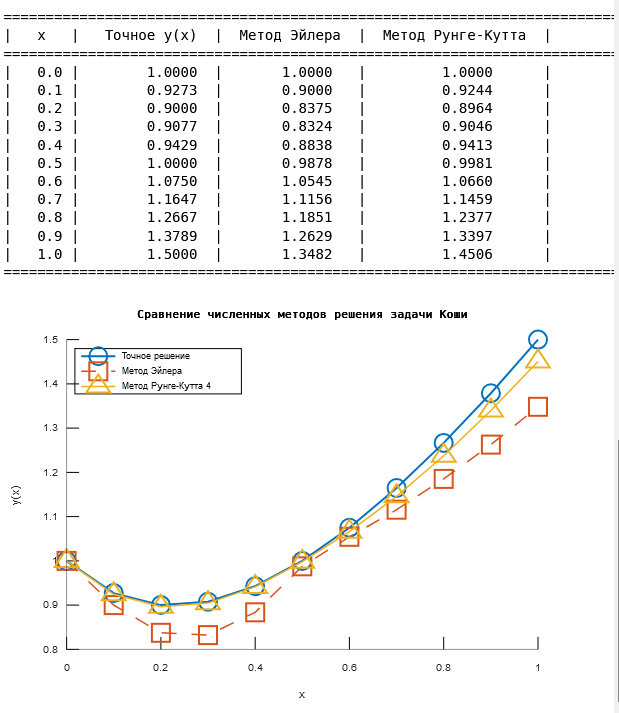
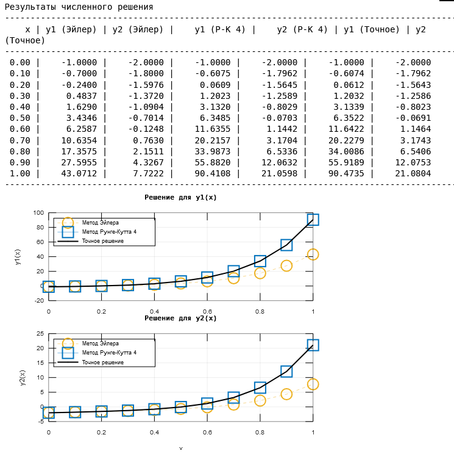
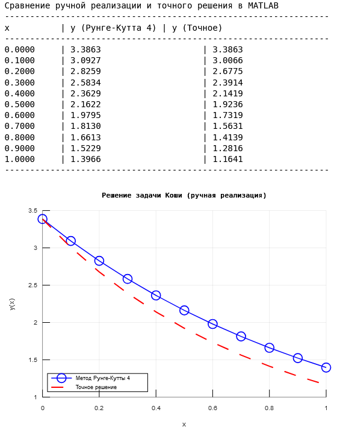

# Методы решения задачи Коши (Euler, RK4) — Python + MATLAB/Octave

[](https://www.python.org/) [](https://numpy.org/) [](https://matplotlib.org/)  [](#лицензия)

Репозиторий с учебной реализацией:
- Решения задачи Коши для обыкновенных дифференциальных уравнений первого порядка.
- Решения задачи Коши для систем обыкновенных дифференциальных уравнений первого порядка.
- Решения задачи Коши для обыкновенных дифференциальных уравнений второго порядка.
 <br>
 
- Реализовано: метод Эйлера, метод Рунге–Кутта 4‑го порядка.
- Языки: Python (NumPy/Matplotlib) и MATLAB/Octave (аналогичная логика).

---

## Стек
- Python 3.10+
- MATLAB R2017a+

## Быстрый старт

### Python
```bash
git clone https://github.com/Monty-Bounty/lr6.git
cd lr6
pip install -r requirements.txt
python lr6_z1.py
```

Скрипт напечатает таблицу значений (точное/Эйлер/RK4) и построит график сравнения.

### MATLAB/Octave
Откройте `lr6_z1.m` в MATLAB и запустите, либо в Octave:
```bash
octave --quiet lr6_z1.m
```

---

## Постановка задачи 1

Рассматривается ОДУ первого порядка:
- уравнение: x(2x − 1)·y′ + y² − (4x + 1)·y + 4x = 0
- начальное условие: y(0) = 1
- отрезок: x ∈ [0, 1], шаг h = 0.1

Для численных методов используем вид y′ = f(x, y):
y′ = [−y² + (4x + 1)y − 4x] / [x(2x − 1)]

Точное решение для сравнения:
y(x) = (2x² + 1) / (x + 1)

Устранимые разрывы: в коде для x ≈ 0 и x ≈ 0.5 используется предельное значение производной (−1 и 2/3 соответственно), чтобы избежать деления на ноль.

---

## Параметры эксперимента
Задаются в начале скриптов:
```python
# lr6_z1.py
x0 = 0.0
y0 = 1.0
h = 0.1
x_end = 1.0
```
Аналогично в `lr6_z1.m`.

---

## Скриншоты/графики





## Лицензия
MIT.
